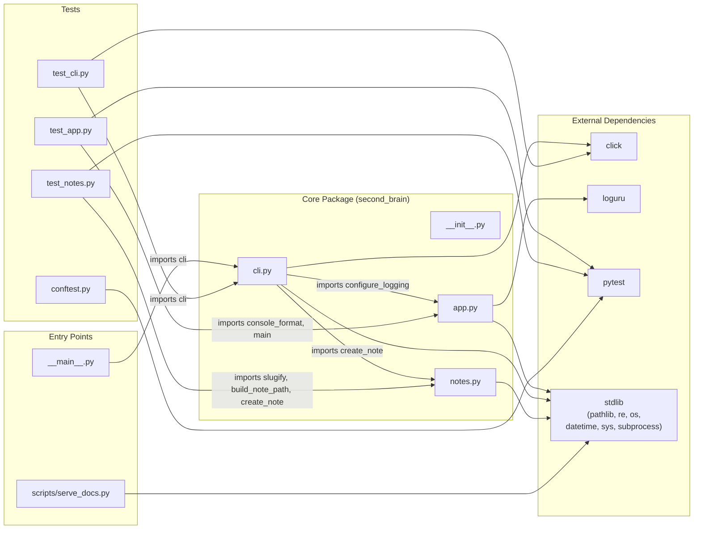

# Module Dependency Map



## Dependency Summary

| Module | Imports From | Safe to Change? |
|--------|-------------|-----------------|
| `notes.py` | stdlib only | Yes — no internal dependents except `cli.py` and `test_notes.py` |
| `app.py` | loguru, stdlib | Yes — only `cli.py` and `test_app.py` depend on it |
| `cli.py` | `app`, `notes`, click | Changing its public API breaks `__main__.py` and `test_cli.py` |
| `__main__.py` | `cli` | Yes — nothing imports from it |
| `scripts/serve_docs.py` | stdlib only | Yes — fully isolated |
| `conftest.py` | pytest | Yes — fixtures affect all tests but no module imports it |

## No Circular Dependencies

The dependency graph is a clean DAG (directed acyclic graph). All data flows in one direction:

```
tests → cli → app
              ↘
        notes
```
